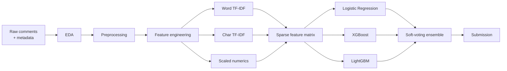

# Comment Category Prediction Challenge

**Kaggle Competition · NLP · Multi-Class Text Classification**

IIT Madras · End-to-end ensemble pipeline for 4-class comment categorization

 

|  Accuracy  | Weighted F1 |  Macro F1  |      Final Model     |
| :--------: | :---------: | :--------: | :------------------: |
| **91.78%** |  **91.87%** | **82.92%** | Soft-Voting Ensemble |

 

[Competition](https://www.kaggle.com/competitions/comment-category-prediction-challenge/overview)
 · 
[Kaggle Profile](https://www.kaggle.com/abhiishek01)
 · 
[LinkedIn](https://www.linkedin.com/in/masterabhishek/)
 · 
[GitHub](https://github.com/22f3002886)

---

## Table of Contents

* [Overview](#overview)
* [Results](#results)
* [Pipeline](#pipeline)
* [Dataset](#dataset)
* [Exploratory Analysis](#exploratory-analysis)
* [Methodology](#methodology)
* [Error Analysis](#error-analysis)
* [Tech Stack](#tech-stack)
* [Repository Layout](#repository-layout)
* [Getting Started](#getting-started)
* [Author](#author)

---

## Overview

This repository contains a complete NLP classification pipeline built for the **Comment Category Prediction Challenge**, a college-hosted Kaggle competition by **IIT Madras**.

The task is to assign each user comment to one of **four categories**, using a mix of raw text and structured metadata (votes, emoticons, identity flags). The target is heavily imbalanced, so the official metric — **Macro F1** — treats every class equally rather than rewarding majority-class accuracy.

The solution covers the full workflow: exploratory analysis, text and tabular preprocessing, 12+ handcrafted features, dual TF-IDF representations, class-imbalance handling, hyperparameter search, and a **soft-voting ensemble** of Logistic Regression, XGBoost, and LightGBM.

**Validation performance of the final ensemble**

* Accuracy — **91.78%**
* Weighted F1 — **91.87%**
* Macro F1 — **82.92%**

---

## Results

Macro F1 is the primary metric. Accuracy and weighted F1 are reported for completeness.

| Rank | Model                            |  Accuracy  | F1 (Weighted) | F1 (Macro) |
| :--: | :------------------------------- | :--------: | :-----------: | :--------: |
|   1  | **Soft-Voting Ensemble** (final) | **91.78%** |   **91.87%**  | **82.92%** |
|   2  | LightGBM                         |   91.65%   |     91.73%    |   82.43%   |
|   3  | XGBoost                          |   90.23%   |     90.65%    |   79.34%   |
|   4  | Logistic Regression              |   89.19%   |     89.84%    |   78.12%   |

The ensemble is a small but consistent lift over the best single model (LightGBM), mainly from better minority-class recall. Linear and tree models disagree on different error modes, so averaging their class probabilities recovers examples that any one model misses.

---

## Pipeline

---

## Dataset

Comments from an online discussion platform. Each row pairs free-text with engagement and identity metadata.

| Feature                                  | Type        | Role                              |
| :--------------------------------------- | :---------- | :-------------------------------- |
| `comment`                                | Text        | Raw user comment                  |
| `upvote` / `downvote`                    | Numeric     | Community votes                   |
| `emoticon_1`, `emoticon_2`, `emoticon_3` | Numeric     | Emoticon usage counts             |
| `if_1`, `if_2`                           | Numeric     | Internal engagement indicators    |
| `race`, `religion`, `gender`             | Categorical | Identity flags                    |
| `disability`                             | Boolean     | Identity flag                     |
| `label`                                  | Target      | Comment category — `{0, 1, 2, 3}` |

The label distribution is sharply skewed. Class 0 dominates; class 3 is rare. That is why Macro F1, not accuracy, is the right score.

| Label | Approx. share | Notes                                       |
| :---: | :-----------: | :------------------------------------------ |
|   0   |      ~58%     | Majority class                              |
|   1   |      ~8%      | Minority                                    |
|   2   |      ~32%     | Second-largest                              |
|   3   |      ~3%      | Hardest class — rare and easily drowned out |

---

## Exploratory Analysis

Three patterns drove the modeling choices.

1. **Severe class imbalance** — a majority-class model would look accurate and still fail Macro F1. Class weights and sample weights are required.
2. **Short, noisy comments** — most comments are well under 250 characters, with a spike near 1,000 (likely truncation). Character-level n-grams help on informal spelling and punctuation.
3. **Metadata is weakly but usefully correlated** — `if_2` is the strongest numeric associate of the label (*r* ≈ 0.23). Emoticon counts correlate with votes more than with the target, so they are kept as supporting features rather than as the main signal.

  
  

  <em>Left: label counts. Right: comment length in characters.</em>

  

  <em>Numeric correlation heatmap. <code>if_2</code> is the strongest correlate of the label.</em>

---

## Methodology

### 1. Preprocessing

| Channel                                                      | Steps                                                                      |
| :----------------------------------------------------------- | :------------------------------------------------------------------------- |
| **Text**                                                     | Lowercasing, URL removal, special-character stripping, whitespace collapse |
| **Numeric**                                                  | Median imputation                                                          |
| **Categorical** (`race`, `religion`, `gender`, `disability`) | Mode imputation, then `LabelEncoder`                                       |

### 2. Feature engineering

Twelve derived features, grouped by source:

| Group           | Features                                                                                                    |
| :-------------- | :---------------------------------------------------------------------------------------------------------- |
| Text statistics | `comment_length`, `word_count`, `avg_word_length`, `uppercase_ratio`, `exclamation_count`, `question_count` |
| Votes           | `vote_diff`, `vote_total`, `vote_ratio`                                                                     |
| Interactions    | `emoticon_total`, `if_diff`, `if_product`                                                                   |

### 3. Feature representation

Three views of each comment are concatenated into one sparse matrix (~10,000+ columns):

| View                   | Configuration                                          |
| :--------------------- | :----------------------------------------------------- |
| Word-level TF-IDF      | 1–3 n-grams, 5,000 features, `sublinear_tf=True`       |
| Character-level TF-IDF | 2–5 char n-grams, 5,000 features, `analyzer='char_wb'` |
| Scaled numerics        | `StandardScaler` inside an sklearn `Pipeline`          |

Word n-grams capture phrasing. Character n-grams absorb typos, slang, and emphasis. Scaled tabular features keep vote and identity signal in the same space as the text.

### 4. Modeling and tuning

| Step          | Detail                                                                        |
| :------------ | :---------------------------------------------------------------------------- |
| Base learners | Logistic Regression, XGBoost, LightGBM                                        |
| Imbalance     | `class_weight='balanced'` and `compute_sample_weight`                         |
| Search        | `RandomizedSearchCV` (cv = 2, scoring = Macro F1) on the strongest base model |
| Final model   | Soft-voting ensemble of all three learners                                    |

Soft voting averages predicted class probabilities. That is more stable here than hard voting, because LightGBM is already strong and the linear model contributes complementary errors rather than a competing majority.

---

## Error Analysis

Confusion matrices on the validation set make the remaining failure mode obvious: **class 3**.

  

  <em>Left to right: Logistic Regression, XGBoost, LightGBM, Voting Ensemble.</em>

* Majority classes 0 and 2 are classified reliably across all models.
* Class 3 is the smallest slice of the data and the main source of Macro F1 loss.
* The ensemble trims some of those minority-class errors relative to Logistic Regression and XGBoost, which is why Macro F1 moves from 82.43% (LightGBM) to **82.92%**.

---

## Tech Stack

| Tool                 | Role                                                             |
| :------------------- | :--------------------------------------------------------------- |
| Python               | Core language                                                    |
| Jupyter Notebook     | Experimentation and the reproducible pipeline                    |
| pandas / NumPy       | Data wrangling                                                   |
| scikit-learn         | Pipelines, TF-IDF, Logistic Regression, voting ensemble, metrics |
| XGBoost              | Gradient-boosted trees                                           |
| LightGBM             | Histogram-based gradient boosting                                |
| Matplotlib / Seaborn | EDA and error analysis                                           |
| Kaggle               | Hosted competition and compute                                   |

---

## Repository Layout

<pre>
.
├── notebook-t12026 (19).ipynb    # Full training, evaluation, and submission pipeline
├── submission (2).csv            # Final competition predictions
└── README.md
</pre>

---

## Getting Started

### 1. Clone

<pre>
git clone https://github.com/22f3002886/Comment-Category-Prediction-Kaggle-ML-Competition.git
cd Comment-Category-Prediction-Kaggle-ML-Competition
</pre>

### 2. Environment

Python 3.10+ recommended.

<pre>
pip install numpy pandas matplotlib seaborn scikit-learn xgboost lightgbm jupyter
</pre>

### 3. Run

<pre>
jupyter notebook "notebook-t12026 (19).ipynb"
</pre>

Run all cells to reproduce preprocessing, training, validation metrics, plots, and the submission file.

> The notebook was developed on **Kaggle**. Locally, point the CSV paths in the data-loading section at your local copies of the competition files.

---

## Author

**Abhishek Kumar**
B.S. Data Science · IIT Madras

* LinkedIn — [linkedin.com/in/masterabhishek](https://www.linkedin.com/in/masterabhishek/)
* GitHub — [github.com/22f3002886](https://github.com/22f3002886)
* Kaggle — [kaggle.com/abhiishek01](https://www.kaggle.com/abhiishek01)

Open to questions, feedback, and collaboration.

---

*Built for the IIT Madras Comment Category Prediction Challenge on Kaggle.*

